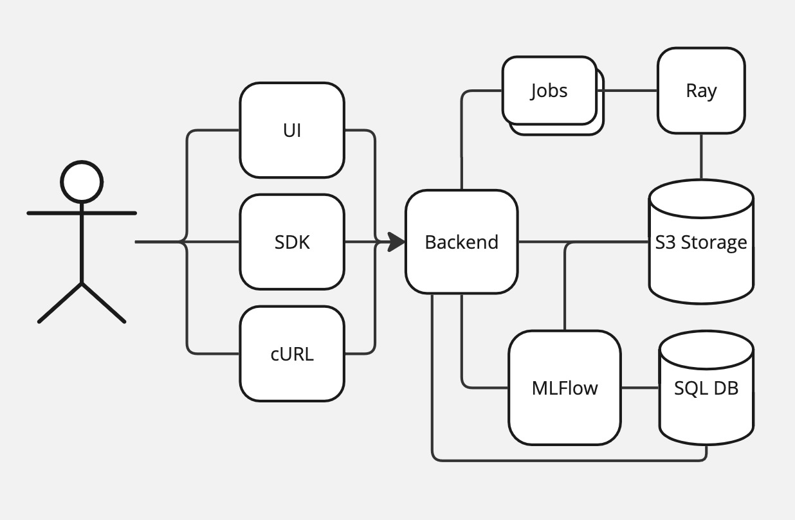

# Lumigator Architecture

The diagram below shows the current architecture of Lumigator. The larger containers (Backend, Ray
cluster, Mlflow, SQL database, and S3-compatible Storage) are the different services Lumigator relies on:



## Lumigator Backend

The components inside the backend are shown in the image below, as is the different abstraction layers
the backend itself relies on:

* The **API** makes backend functionalities available to the UI through different **routes** (see: {{ '[schema code](https://github.com/mozilla-ai/lumigator/blob/{}/lumigator/backend/backend/api/routes)'.format(commit_id) }} ).
{{ '[**Schemas**](https://github.com/mozilla-ai/lumigator/blob/{}/lumigator/schemas)'.format(commit_id) }}
  are used in the API which allows one to exactly know which kind of data has to be passed to it.

* **Services** implement the actual functionalities and are called by the different methods exposed
  in the API (see: {{ '[backend services](https://github.com/mozilla-ai/lumigator/blob/{}/lumigator/backend/backend/services)'.format(commit_id) }} ).

* **Repositories** implement the [repository pattern](https://www.cosmicpython.com/book/chapter_02_repository.html)
  as an abstraction over the SQL database (see: {{ '[code for repositories](https://github.com/mozilla-ai/lumigator/blob/{}/lumigator/backend/backend/repositories)'.format(commit_id) }} ).
  They make use of {{ '[record classes](https://github.com/mozilla-ai/lumigator/blob/{}/lumigator/backend/backend/records)'.format(commit_id) }} to refer to actual records in the database. Currently, the repositories manage the state of the jobs, while the tracking interface manages the state and information about experiments and workflows (and retrieves the info about certain jobs when they are relevant).

* **Tracking** implement the tracking interface which is used to log and track the state of experiments and workflows (see: {{ '[code for tracking](https://github.com/mozilla-ai/lumigator/blob/{}/lumigator/backend/backend/tracking)'.format(commit_id) }} ). Currently, Mlflow is the only implementation of the tracking interface, but it's designed in such a way to support alternative tracking implementations in the future.


```{admonition} Notation
In the following, we will refer to paths inside Lumigator's repo relative to the
`/lumigator/backend` folder, e.g. the relative path `backend/api/routes` (note the lack of a
trailing slash) will map to the absolute path from the root of the repo
`/lumigator/backend/backend/api/routes`.
```

## Backend Routes

For more information about the backend routes, see the [API Specs](../api/index).
