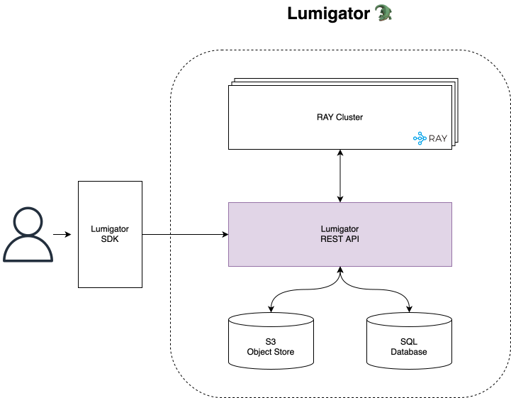
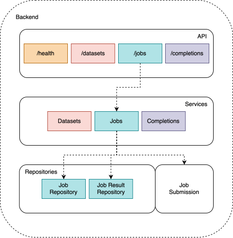
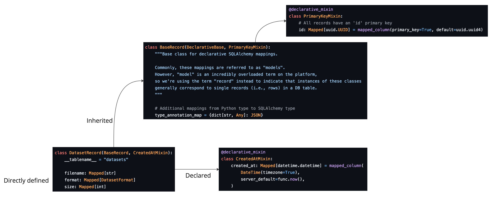
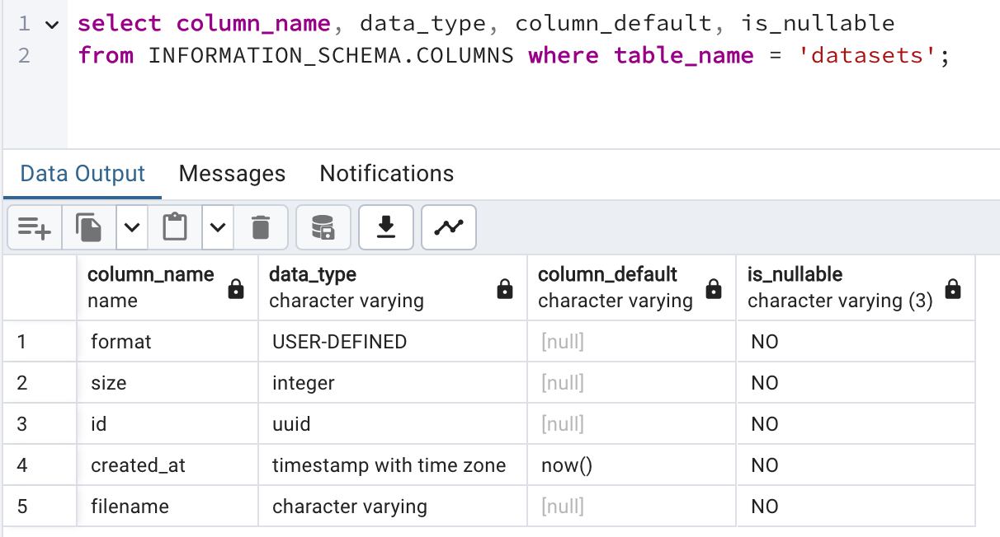

# Understanding Lumigator Endpoints

This document shows how current endpoints in lumigator work. If you want to customize lumigator with
your own custom endpoints/jobs this is a good place to start!

## Lumigator's architecture

The diagram below shows the current architecture of Lumigator. The larger containers (Backend, Ray
cluster, SQL database, and S3-compatible Storage) are the different services Lumigator relies on:



The components inside the backend, shown in the image below, are the different abstraction layers
the backend itself relies on:

* The **API** makes backend functionalities available to the UI through different **routes** (see: [schema code](https://github.com/mozilla-ai/lumigator/tree/b1ea63ba3e1aae5907e46ffbe9bfd809253c6053/lumigator/python/mzai/backend/backend/api/routes)).
  [**Schemas**](https://github.com/mozilla-ai/lumigator/tree/b1ea63ba3e1aae5907e46ffbe9bfd809253c6053/lumigator/python/mzai/schemas/schemas)
  are used in the API which allows one to exactly know which kind of data has to be passed to it.

* **Services** implement the actual functionalities and are called by the different methods exposed
  in the API (see: [backend services](https://github.com/mozilla-ai/lumigator/tree/main/lumigator/python/mzai/backend/backend/services)).

* **Repositories** implement the [repository pattern](https://www.cosmicpython.com/book/chapter_02_repository.html)
  as an abstraction over the SQL database (see: [code for repositories](https://github.com/mozilla-ai/lumigator/tree/main/lumigator/python/mzai/backend/backend/repositories)).
  They make use of [record classes](https://github.com/mozilla-ai/lumigator/tree/main/lumigator/python/mzai/backend/backend/records) to refer to actual records in the database.



```{admonition} Notation
In the following, we will refer to paths inside Lumigator's repo relative to the
`/lumigator/python/mzai/backend` folder, e.g. the relative path `backend/api/routes` (note the lack of a
trailing slash) will map to the absolute path from the root of the repo
`/lumigator/python/mzai/backend/backend/api/routes`.
```

## Lumigator endpoints

All the endpoints you can access in Lumigator's API are defined in
[`backend/api/routes/`](https://github.com/mozilla-ai/lumigator/tree/b1ea63ba3e1aae5907e46ffbe9bfd809253c6053/lumigator/python/mzai/backend/backend/api/routes)
and explicitly listed in
[`backend/api/router.py`](https://github.com/mozilla-ai/lumigator/blob/b1ea63ba3e1aae5907e46ffbe9bfd809253c6053/lumigator/python/mzai/backend/backend/api/router.py),
together with a [metadata tag](https://github.com/mozilla-ai/lumigator/blob/b1ea63ba3e1aae5907e46ffbe9bfd809253c6053/lumigator/python/mzai/backend/backend/api/tags.py)
which is used to provide a short description of the route.

Let us now walk through a few examples to understand how Lumigator's endpoints work.

### The simplest endpoint: `/health`

The [`/health`](https://github.com/mozilla-ai/lumigator/blob/b1ea63ba3e1aae5907e46ffbe9bfd809253c6053/lumigator/python/mzai/backend/backend/api/routes/health.py)
route provides perhaps the simplest example as it allows you to get the current backend status which
is a constant:

```python
@router.get("/")
def get_health() -> HealthResponse:
    return HealthResponse(deployment_type=settings.DEPLOYMENT_TYPE, status="OK")
```

Note that the returned type is a `HealthResponse`: this is a
[pydantic model](https://docs.pydantic.dev/latest/api/base_model/) defining the schema of the
returned data. The general rule is that all return values in our routes should match a predefined
schema. Schemas are defined under the `schemas` directory (see: [health response in our source code](https://github.com/mozilla-ai/lumigator/blob/d87dc33b4578d1fe89277ba2412ab53857c9cad8/lumigator/python/mzai/schemas/lumigator_schemas/extras.py#L16)),
typically in files with the same name of the route, service, etc.

All the code for `get_health()` appears in the route file. A `HealthResponse`, composed of a
deployment type which is loaded from
[`backend/settings.py`](https://github.com/mozilla-ai/lumigator/blob/b1ea63ba3e1aae5907e46ffbe9bfd809253c6053/lumigator/python/mzai/backend/backend/settings.py#L12)
and the status (currently always ok), is returned.

### One step further: `/datasets`

The `/datasets` route is a bit more complex as it has to interface both with the DB and the storage.
The simplest method there, `get_dataset`, already has basically all the components you'd find in
most of the advanced methods:

```python
@router.get("/{dataset_id}")
def get_dataset(service: DatasetServiceDep, dataset_id: UUID) -> DatasetResponse:
    return service.get_dataset(dataset_id)
```

* The core functionalities are provided by a *service* (in this case a `DatasetService`) defined in
  [`backend/services/datasets.py`](https://github.com/mozilla-ai/lumigator/blob/b1ea63ba3e1aae5907e46ffbe9bfd809253c6053/lumigator/python/mzai/backend/backend/services/datasets.py).

* Instead of directly passing a `DatasetService` to the `get_dataset` method, DatasetServiceDep is
  defined to perform a *dependency injection* (see:
  [FastAPI's dependencies](https://fastapi.tiangolo.com/tutorial/dependencies/)).

* As with the `/health` endpoint, a *schema* defines the return type (in this case a
  `DatasetResponse`).

* The `repository` abstraction is used to access data in the database.

So, let us suppose you have already uploaded a dataset to Lumigator. What happens when you hit the
`/datasets` endpoint by passing a dataset id?

First thing, `DatasetServiceDep` will make sure that all the dependencies to run your
`DatasetService` are met. If you look at
[`backend/api/deps.py`](https://github.com/mozilla-ai/lumigator/blob/b1ea63ba3e1aae5907e46ffbe9bfd809253c6053/lumigator/python/mzai/backend/backend/api/deps.py)
you will see that a `DatasetServiceDep` is nothing more than a `DatasetService` that depends on a
`DBSessionDep` and `S3ClientDep`:

```python
def get_dataset_service(
    session: DBSessionDep, s3_client: S3ClientDep, s3_filesystem: S3FileSystemDep
) -> DatasetService:
    dataset_repo = DatasetRepository(session)
    return DatasetService(dataset_repo, s3_client, s3_filesystem)


DatasetServiceDep = Annotated[DatasetService, Depends(get_dataset_service)]
```

`DBSessionDep` and `S3ClientDep` provide an additional level of dependencies, namely on a
database session and on an S3 client.

While the S3 dependency is a "simple" one (i.e., it just instantiates a boto3 client in place), the
database one is a bit more advanced (i.e., it relies on a
[`DatabaseSessionManager`](https://github.com/mozilla-ai/lumigator/blob/b1ea63ba3e1aae5907e46ffbe9bfd809253c6053/lumigator/python/mzai/backend/backend/db.py)
to return a session).

Second, `DatasetService` provides a `get_dataset` method which gets the actual data from the
database and returns a `DatasetResponse` after validating it:

```python
def get_dataset(self, dataset_id: UUID) -> DatasetResponse:
    record = self._get_dataset_record(dataset_id)
    return DatasetResponse.model_validate(record)

def _get_dataset_record(self, dataset_id: UUID) -> DatasetRecord:
    record = self.dataset_repo.get(dataset_id)

    if record is None:
        self._raise_not_found(dataset_id)
    return record
```

We access the database using the `repository` abstraction `DatasetRepository` class. All
repositories are defined in `backend/repositories` and inherit from
[`BaseRepository`](https://github.com/mozilla-ai/lumigator/blob/b1ea63ba3e1aae5907e46ffbe9bfd809253c6053/lumigator/python/mzai/backend/backend/repositories/base.py)
which is a general class providing ORM access to SQL statements. In particular, the
`DatasetRepository` is a `BaseRepository` working with items of type
[`DatasetRecord`](https://github.com/mozilla-ai/lumigator/blob/b1ea63ba3e1aae5907e46ffbe9bfd809253c6053/lumigator/python/mzai/backend/backend/records/datasets.py).

Fields in records are defined as a mix of explicit type definitions and declarative mappings (see the picture below to
see how the fields in the datasets table are defined).



Definition of the fields appearing in `DatasetRecord`:



## Common patterns

The examples above show the main patterns we follow to develop a generic endpoint. These are
reflected in a rather standard code structure:

| Directory            | Description                                                   |
|----------------------|---------------------------------------------------------------|
| backend/api/routes   | The actual API endpoints one can hit.                         |
| backend/services     | The code that implements core functionalities for each route. |
| backend/api/deps.py  | Used to inject dependencies for services.                     |
| backend/repositories | Repositories used by each service.                            |
| backend/records      | Records used by each service.                                 |
| schemas              | The schemas used by each route/service.                       |

The general rule is that for most endpoints you'll end up with an identical filename for each of the
above directories (see e.g. `datasets`, `experiments`, etc).

## Next steps

Now that you have a basic understanding of how Lumigator's endpoints work, you can start creating
your own! The best way to do this is to start by copying an existing endpoint and modifying it to
fit your needs.
