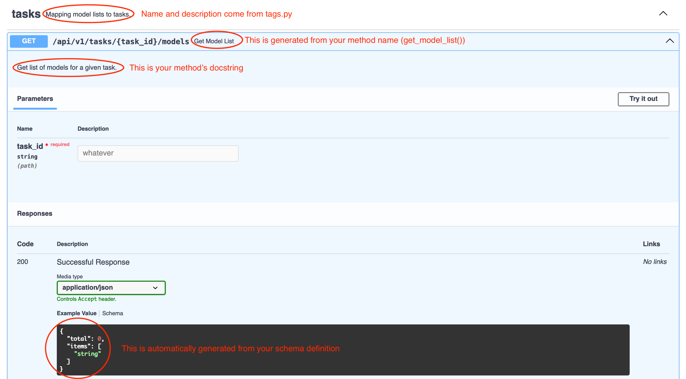
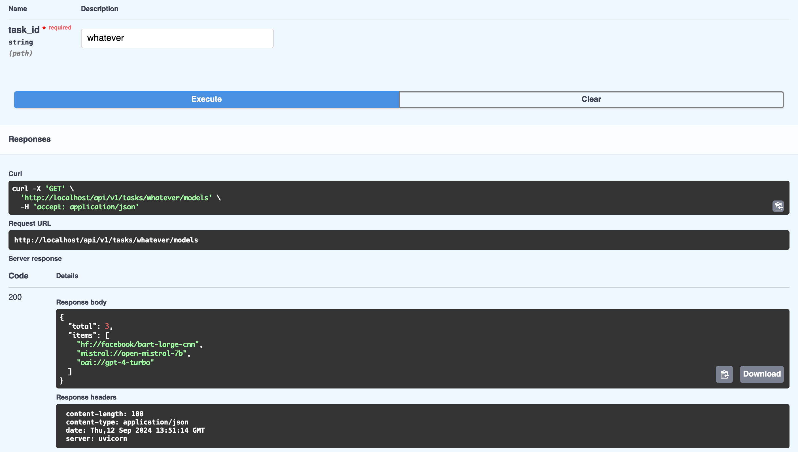

# Creating a New Endpoint

The examples in the [Understanding Lumigator Endpoints](https://mozilla-ai.github.io/lumigator/conceptual-guides/endpoints.html)
guide show the main pieces of code involved in writing a new endpoint. Let us take a toy example,
which is creating an endpoint which given a task in the form of a string (e.g. "summarization") will
return a list of model names (string URIs) to be evaluated for that task. As you do not have a table
with this information in our database yet, you will also create a method to actually *store* this
list in a table.

## Step 1: Create a static endpoint

As a first step, you'll create a static endpoint which, regardless of the input, will always return
the same list of models. This is a good way to start as it allows you to wire the endpoint, see it
in the docs, and make sure its schema is correct, without the need to access the database yet.

### 1.1. Write the router code

The following code implements a barebone version of our endpoint, one which does not require any
connection to the DB nor a specific schema definition. It defines one method `get_model_list` that
always returns a `ListingResponse[str]` object, basically a dictionary containing a list of `items`
of a predefined type (strings in our case) and a `total` field with the number of items. Note that
`task_id` is not even used, but this will change as soon as we want to get a list which is
task-specific.

```python
from fastapi import APIRouter
from schemas.extras import ListingResponse


router = APIRouter()

@router.get("/{task_id}/models")
def get_model_list(task_id: str) -> ListingResponse[str]:
    """Get list of models for a given task."""
    return_data = {
        "total": 3,
        "items": [
            "hf://facebook/bart-large-cnn",
            "mistral://open-mistral-7b",
            "oai://gpt-4-turbo",
        ],
    }
    return ListingResponse[str].model_validate(return_data)
```

Being this the code for a new route, you will save it in `backend/api/routes/tasks.py`.

### 1.2. Add the route to `router.py` with the appropriate tags

The following step is adding the new route to
[`backend/api/router.py`](https://github.com/mozilla-ai/lumigator/blob/{{ commit_id }}/lumigator/lumigator/backend/backend/api/router.py).
The code below shows the updated file with comments next to the two lines marked below as **NEW**:

```python
from fastapi import APIRouter


from backend.api.routes import (
    completions,
    datasets,
    experiments,
    health,
    tasks,  # NEW
)
from backend.api.tags import Tags

API_V1_PREFIX = "/api/v1"

api_router = APIRouter(prefix=API_V1_PREFIX)
api_router.include_router(health.router, prefix="/health", tags=[Tags.HEALTH])
api_router.include_router(datasets.router, prefix="/datasets", tags=[Tags.DATASETS])
api_router.include_router(experiments.router, prefix="/experiments", tags=[Tags.EXPERIMENTS])
api_router.include_router(completions.router, prefix="/completions", tags=[Tags.COMPLETIONS])
api_router.include_router(tasks.router, prefix="/tasks", tags=[Tags.TASKS])  # NEW
```

Also note that we are specifying some `Tags.TASKS` which have not been defined yet! Open
[`backend/api/tags.py`](https://github.com/mozilla-ai/lumigator/blob/{{ commit_id }}/lumigator/lumigator/backend/backend/api/tags.py)
and add the sections marked below as **NEW**:

```python
from enum import Enum


class Tags(str, Enum):
    HEALTH = "health"
    DATASETS = "datasets"
    EXPERIMENTS = "experiments"
    COMPLETIONS = "completions"
    TASKS = "tasks" ### NEW


TAGS_METADATA = [
    {
        "name": Tags.HEALTH,
        "description": "Health check for the application.",
    },
    {
        "name": Tags.DATASETS,
        "description": "Upload and download datasets.",
    },
    {
        "name": Tags.EXPERIMENTS,
        "description": "Create and manage evaluation experiments.",
    },
    {
        "name": Tags.COMPLETIONS,
        "description": "Access models via external vendor endpoints",
    },
    # NEW TAGS BELOW
    {
        "name": Tags.TASKS,
        "description": "Mapping model lists to tasks.",
    },
]
```

### 1.3. Test

If you're running Lumigator locally, connect to [`http://localhost:8000/docs`](http://localhost:8000/docs)
and you should see the following:



If you click on `Try it out`, add any value for `task_id` and then click on `Execute` you should get
the following response:



## Step 2: Wire the endpoint to the DB

You have a new running endpoint! Too bad it always return the same identical data... Let's fix this
by connecting it to the database.

### 2.2. Define schema

To have a more useful endpoint, let us first update the schema with a few additional fields. The
following goes into`schemas/tasks.py`:

```python
import datetime
from uuid import UUID

from pydantic import BaseModel


class TaskCreate(BaseModel):
    name: str
    description: str = ""
    models: list[str]

class TaskResponse(BaseModel, from_attributes=True):
    id: UUID
    name: str
    description: str
    created_at: datetime.datetime
    models: list[str]
```

If you look at `TaskResponse`, you can see that we added an `id` to uniquely identify the task, a
`name` that we can show e.g. in a list for users to choose from and a `description`. The field
`created_at` will be automatically filled when creating a new record. The list of `models` still
appears, but we removed the count as we'll likely provide short lists and we can expect to be able
to get their length programmatically.

The `TaskCreate` class, instead, will be used to define the input to the `create_task` method in the
API (the fields `id` and `created_at` are not necessary, as they'll be created automatically by the
database).

### 2.2. Define repositories and records

The code for a new repository (to be stored in `backend/repositories/tasks.py`) is quite standard:

```python
from sqlalchemy.orm import Session

from backend.records.tasks import TaskRecord
from backend.repositories.base import BaseRepository


class TaskRepository(BaseRepository[TaskRecord]):
    def __init__(self, session: Session):
        super().__init__(TaskRecord, session)
```

This does not usually change much as long as you are fine with the base methods provided by the
[`BaseRepository`](https://github.com/mozilla-ai/lumigator/blob/{{ commit_id }}/lumigator/lumigator/backend/backend/repositories/base.py)
class.

The `TaskRepository` is a repository that allows to run the set of methods defined in the
`BaseRepository` on the table defined by `TaskRecord`. You can define a `TaskRecord` in
`backend/records/tasks.py` as follows:

```python
from sqlalchemy.orm import Mapped, mapped_column

from backend.records.base import BaseRecord
from backend.records.mixins import CreatedAtMixin, NameDescriptionMixin


class TaskRecord(BaseRecord, NameDescriptionMixin, CreatedAtMixin):
    __tablename__ = "tasks"
    models: Mapped[list[str]] = mapped_column(nullable=False)
```

Similarly to what you saw before for `DatasetRecord`, `TaskRecord` inherits from
[`BaseRecord`](https://github.com/mozilla-ai/lumigator/blob/{{ commit_id }}/lumigator/lumigator/backend/backend/records/base.py)
the property of having an `id` primary key. In addition to that, it inherits `name` and
`description` from `NameDescriptionMixin` and `created_at` from `CreatedAtMixin`. The only field
that we need to specify manually is `models`, a non-null column holding a list of strings.

As SQLAlchemy does not have a built-in mapping from `list[str]`, you also need to update
`BaseRecord` to provide one explicitly by changing the following:

```python
type_annotation_map = {dict[str, Any]}
```

to

```python
type_annotation_map = {dict[str, Any]: JSON, list[str]: JSON}
```

### 2.3. Save DB-accessing methods into a TasksService

Now that you have an abstraction for the `tasks` table, you can use it to implement the different
methods needed to manage tasks. You'll do it inside `backend/services/tasks.py`:

```python
from uuid import UUID

from fastapi import HTTPException, status

from backend.records.tasks import TaskRecord
from backend.repositories.tasks import TaskRepository
from schemas.extras import ListingResponse
from schemas.tasks import TaskCreate, TaskResponse


class TaskService:
    def __init__(self, tasks_repo: TaskRepository):
        self.tasks_repo = tasks_repo

    def _raise_not_found(self, task_id: UUID) -> None:
        raise HTTPException(status.HTTP_404_NOT_FOUND, f"Task '{task_id}' not found.")

    def _get_task_record(self, task_id: UUID) -> TaskRecord:
        record = self.tasks_repo.get(task_id)

        if record is None:
            self._raise_not_found(task_id)
        return record

    def get_task(self, task_id: UUID) -> TaskResponse:
        record = self._get_task_record(task_id)
        return TaskResponse.model_validate(record)

    def create_task(self, request: TaskCreate) -> TaskResponse:
        # Create DB record
        record = self.tasks_repo.create(
            name=request.name, description=request.description, models=request.models
        )
        return TaskResponse.model_validate(record)

    def delete_task(self, task_id: UUID) -> None:
        record = self._get_task_record(task_id)
        # Delete DB record
        self.tasks_repo.delete(record.id)

    def list_tasks(self, skip: int = 0, limit: int = 100) -> ListingResponse[TaskResponse]:
        total = self.tasks_repo.count()
        records = self.tasks_repo.list(skip, limit)
        return ListingResponse(
            total=total,
            items=[TaskResponse.model_validate(x) for x in records],
        )
```

The main methods implemented here are:

* `create_task`: uses the `create` method in the task repository (a method inherited by
  `BaseRepository`) to save a new task record. The `request` input parameter is defined in the
  `TaskCreate` schema and the output is a `TaskResponse`.

* `delete_task`: given a task `UUID`, deletes the corresponding record from the table. Note that, as
  all the other methods that rely on `_get_task_record`, an HTTP 404 exception is thrown if a
  matching record is not found in the table.

* `get_task`: given a task `UUID`, return the corresponding record (as a `TaskResponse`)

* `list_tasks`: returns a `ListingResponse` of `TaskResponse` elements (i.e. a list of tasks stored
  in the table).

Note how similar this is to some of the other services (e.g. `DatasetService`): you can expect this
from services which only deal with the DB as the main operations you'll do are those who operate on
a table (create, delete, get, list, etc). You will likely see a different behavior in more advanced
endpoints (e.g. those which involve running ray jobs), but we'll discuss that in another tutorial.

### 2.4. Inject dependencies into a TaskService

As `TaskService` depends on the existence of a database, we should inject a dependency on a DB session.
To do this, add the following code to
[`backend/api/deps.py`](https://github.com/mozilla-ai/lumigator/blob/{{ commit_id }}/lumigator/lumigator/backend/backend/api/deps.py):

```python
def get_task_service(session: DBSessionDep) -> TaskService:
    task_repo = TaskRepository(session)
    return TaskService(task_repo)


TaskServiceDep = Annotated[TaskService, Depends(get_task_service)]
```

### 2.5. Update routes

You are almost there! The last thing you need to do is update the `backend/api/routes/tasks.py`file
with new code which will map API requests to `TaskService` methods:

```python
from uuid import UUID

from fastapi import APIRouter, status

from backend.api.deps import TaskServiceDep
from schemas.extras import ListingResponse
from schemas.tasks import TaskCreate, TaskResponse

router = APIRouter()


@router.post("/", status_code=status.HTTP_201_CREATED)
def create_task(service: TaskServiceDep, request: TaskCreate) -> TaskResponse:
    return service.create_task(request)


@router.get("/{task_id}")
def get_task(service: TaskServiceDep, task_id: UUID) -> TaskResponse:
    return service.get_task(task_id)


@router.delete("/{task_id}", status_code=status.HTTP_204_NO_CONTENT)
def delete_task(service: TaskServiceDep, task_id: UUID) -> None:
    service.delete_task(task_id)


@router.get("/")
def list_tasks(
    service: TaskServiceDep,
    skip: int = 0,
    limit: int = 100,
) -> ListingResponse[TaskResponse]:
    return service.list_tasks(skip, limit)
```

### 2.6. Test

To test your new endpoint, connect to [http://localhost:8000/docs](http://localhost/docs). You
should see a new section like the following one:


Here is an example for the creation of a new task:


And here is the format of a task list (to which we have also added a `summarization_eval` task):


## Final checks and reference code

Creating a new endpoint in Lumigator requires some prior knowledge about the system and due to how
the code is structured you will have to edit many different files (see the picture below). Once you
get the gist of it, though, the task can be quite straightforward (albeit a bit repetitive),
especially if the endpoint mostly has to deal with database operations.
