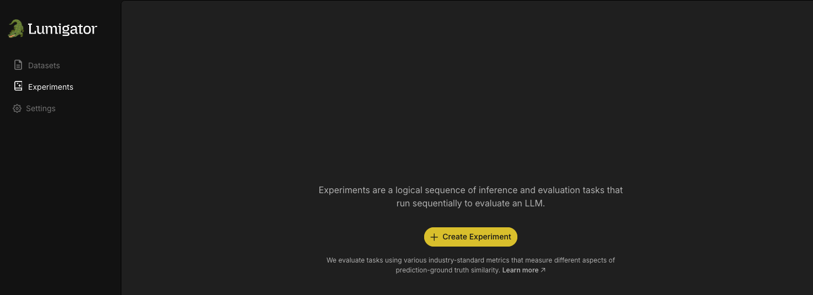

# Using Lumigator UI
Lumigator comes with a web-based UI that allows you to interact with the Lumigator API. It is designed to be easy to use and to provide a quick way to get started with Lumigator.

## Getting Started
Follow the [installation guide](../get-started/installation.md) to get Lumigator up and running.
```console
user@host:~/lumigator$ make start-lumigator
```
The UI can then be accessed by visiting [localhost](http://localhost) on a web browser. You should be able to see a screen with the sections **Datasets** and **Experiments**. Lets go through each of them in detail.

## Upload a Dataset
The first step is to upload a dataset. This can be done by clicking on the **Provide Dataset** button in the **Datasets** section. This will open a dialog box where you can select the dataset file to be uploaded from your local machine. The dataset file should be in `csv` format with columns examples and (optionally) ground_truth.


Once the dataset is uploaded, it can be viewed as a row in the table in the **Datasets** section.


## Create and Run an Experiment
Next we move on to the **Experiments** section. Start by clicking on the **Create Experiment** button.



This will open a sidebar where you would specify which use case and dataset, and further experiment details. The maximum samples field defines the number of rows from the dataset to be used for the experiment, on which Lumigator would run inference and evaluation to generate results.

Below that, you have the option to select the models to be used for the experiment. Multiple models can be simultaneously selected.

|  |  |
| --- | --- |

```{note}
In order to be able to use API based models, you need to provide the respective API keys (`OPENAI_API_KEY` or `MISTRAL_API_KEY`) as environment variables before starting Lumigator.
```console
user@host:~/lumigator$ export MISTRAL_API_KEY=<your_mistral_api_key>
```

Finally click the **Run Experiment** button.


The **Experiments** page gets populated with the experiment details and the status of the experiment, which would initially be `RUNNING` and changes to `SUCCEEDED` once the experiment is complete or `FAILED` if the experiment fails.


## View Results
For each experiment, you can view the sidebar which contains a **View Results** button. On clicking this button, we would be able to see a table with evaluation metrics comparing the previously selected models.


You can further view the row by row predictions for each individual model by expanding under a given model. This gives you a detailed view of how the model predictions compare to the ground truth for each instance in the dataset.


Congratulation! With that, you have successfully run your first experiment using the Lumigator UI! You can continue to run more experiments by uploading your custom datasets and selecting from among the different models available.
