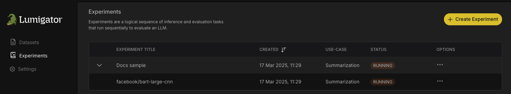

# Using Lumigator UI

Lumigator comes with a web-based UI that allows you to interact with the Lumigator API. It is designed to be easy to use and to provide a quick way to get started with Lumigator.

## Getting Started

Follow the [quickstart](quickstart.md) to get Lumigator up and running. The UI can then be accessed by visiting [localhost](http://localhost) on your web browser. You should be able to see a screen with the sections **Datasets** and **Experiments**. Lets go through each of them in detail.

## Upload a Dataset

The main purpose of Lumigator is to help you select the model that works best for your particular data, amongst several available. It does this by evaluating multiple models on a sample of your data: your dataset.

The first step is to upload your dataset. This can be done by clicking on the **Provide Dataset** button in the **Datasets** section. This will open a dialog box where you can select the dataset file to be uploaded from your local machine. The dataset file should be in `csv` format with columns examples and (optionally) ground_truth.

You can get started by uploading the {{ '[sample dataset](https://github.com/mozilla-ai/lumigator/blob/{}/lumigator/sample_data/summarization/dialogsum_exc.csv)'.format(commit_id) }} provided in the [Lumigator repository](https://github.com/mozilla-ai/lumigator).


Once the dataset is uploaded, it can be viewed as a row in the table in the **Datasets** section.


## Experiments

### Settings

If you want to evaluate against hosted API-based LLM services such as the platforms provided by OpenAI, Mistral, or Deepseek,
you will need to set the appropriate [API key setting](../operations-guide/configuration.md#api-settings) as a secret in Lumigator.

To do this visit the **Settings** section listed in the navigation bar on the left.

**Note:** API key settings **must** be configured before we try to start an experiment that requires them,
otherwise Lumigator will not be able to use them.


Here you can see the settings page where you can currently set the API keys for Mistral, OpenAI, Hugging Face and DeepSeek.
The first time you visit this page the settings will be empty. You can add the API keys by filling in the relevant field and
clicking on the **Save** button.


The UI will provide a confirmation message that the secret has been saved, and the value will no longer be available.

**Note:** The secret value will not be displayed again, and cannot be retrieved via the Lumigator API,
so prior to entering it, make sure to save it in a secure location, such as a password manager.


If you ever generate a new API key and want to update the secret, you can do so by entering the new value and clicking
on the **Save** button again.

You can also delete the secret by clicking on the **Delete** button, which is represented by a trash can icon.


Clicking on the **Delete** button will prompt you to confirm the deletion of the API key.


Click on the **Delete** button in the confirmation dialog to delete the secret from Lumigator, or the **Cancel** button
to abort the deletion and return you to the settings page.

After confirming the request to delete the API key, the UI will provide a confirmation message that the secret has been deleted.


### Create and Run an Experiment

Next we move on to the **Experiments** section. Start by clicking on the **Create Experiment** button.


This will open a sidebar where you would specify which use case and dataset, and further experiment details. The maximum samples field defines the number of rows from the dataset to be used for the experiment, on which Lumigator would run inference and evaluation to produce as results the [relevant metrics](quickstart.md#get-the-results).

Below that, you have the option to select the models to be used for the experiment. Multiple models may be simultaneously selected.

|  |  |
| --- | --- |

```{note}
Reminder: In order to be able to use API based models, you must have provided the respective secret API keys to Lumigator, via the settings (UI/SDK). See more in the [API settings configuration](../operations-guide/configuration.md#api-settings).
```

Finally click the **Run Experiment** button.



The **Experiments** page gets populated with the experiment details and the status of the experiment, which would initially be `RUNNING` and changes to `SUCCEEDED` once the experiment is complete or `FAILED` if the experiment fails.


## View Results
For each experiment, you can view the sidebar which contains a **View Results** button. On clicking this button, we would be able to see a table with evaluation metrics comparing the previously selected models.


You can further view the row by row predictions for each individual model by expanding under a given model. This gives you a detailed view of how the model predictions compare to the ground truth for each instance in the dataset.


---

Congratulations! With that, you have successfully run your first experiment using the Lumigator UI! You can continue to run more experiments by uploading your custom datasets and selecting from among the different models available.
